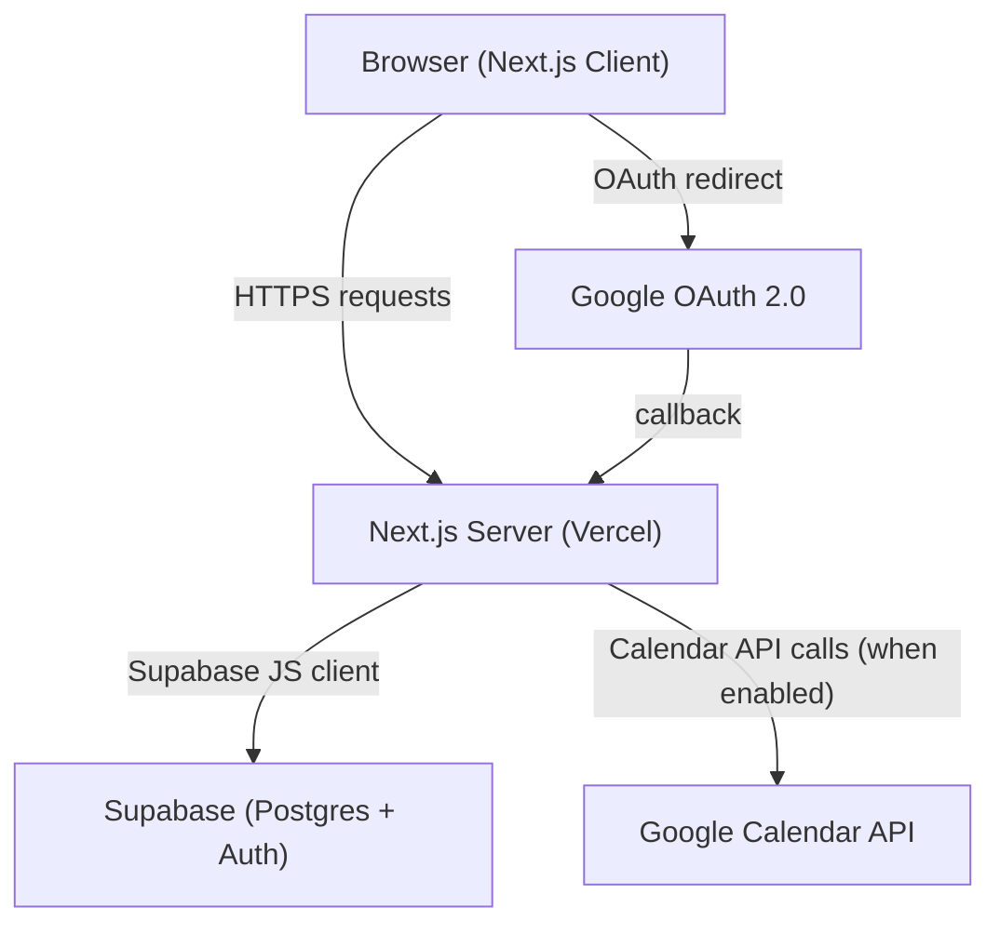

# Design Document: Convey Task Manager

## Overview

The Convey Task Manager is a personal productivity web application built around Stephen Covey's Time Management Matrix. Users authenticate via Google OAuth (through Supabase Auth), manage tasks organized into four quadrants by importance and urgency, and optionally sync tasks with Google Calendar.

**Stack:**
- Frontend: Next.js 14 (App Router) + Tailwind CSS
- Backend: Next.js API Routes (serverless, deployed on Vercel)
- Database + Auth: Supabase (PostgreSQL + Row Level Security + Supabase Auth)
- Drag-and-drop: `@dnd-kit/core`
- Calendar: Google Calendar API (optional, opt-in)

**Key design decisions:**
- App Router with React Server Components for initial data fetching; client components for interactive UI (matrix, drag-and-drop, forms)
- Escalation is computed server-side on page load and via a lightweight polling mechanism on the client — no separate cron job required for MVP
- Google Calendar integration is entirely opt-in; the additional OAuth scope is only requested when the user explicitly enables it from Settings
- RLS policies in Supabase enforce data isolation at the database layer, providing defense-in-depth beyond API-level auth checks

---

## Architecture



### Request Flow

1. Unauthenticated users land on `/` (sign-in page) and initiate Google OAuth via Supabase Auth.
2. After OAuth callback, Supabase establishes a session; Next.js middleware redirects authenticated users to `/matrix`.
3. The Matrix page is a client component that fetches tasks via a Supabase JS client (using the user's session cookie).
4. Mutations (create, update, delete, complete, reassign) go through Next.js API routes that validate the session server-side before touching Supabase.
5. Escalation is checked on every Matrix page load and on a 60-second client-side polling interval.
6. Calendar sync operations are triggered from the same API routes that handle task mutations, gated by the user's `calendar_enabled` flag.

---

## Components and Interfaces

### Page Structure

```
app/
  page.tsx                  # Landing / sign-in page
  matrix/
    page.tsx                # Matrix view (protected)
  history/
    page.tsx                # Completed tasks history (protected)
  settings/
    page.tsx                # Settings page (protected)
  api/
    tasks/
      route.ts              # GET (list), POST (create)
    tasks/[id]/
      route.ts              # PATCH (update/reassign), DELETE
    tasks/[id]/complete/
      route.ts              # POST (mark complete)
    completed-tasks/
      route.ts              # GET (list completed)
    completed-tasks/[id]/
      route.ts              # DELETE (permanent delete)
    escalation/
      route.ts              # POST (run escalation check)
    settings/
      route.ts              # GET, PATCH (calendar toggle)
    auth/
      callback/
        route.ts            # Supabase OAuth callback handler
  middleware.ts             # Session guard — redirects unauthenticated users
```

### Key Client Components

**`MatrixBoard`** — renders the 2×2 grid, wraps quadrant panels in a DnD context.

**`QuadrantPanel`** — renders a single quadrant with its task cards; acts as a drop target.

**`TaskCard`** — draggable card showing title and deadline; opens edit modal on click.

**`TaskFormModal`** — create/edit form with validation; handles title, description, deadline, urgency threshold, quadrant.

**`HistoryList`** — paginated list of completed tasks with delete action.

**`SettingsForm`** — toggle for Calendar Integration; triggers OAuth scope request when enabled.

### API Route Contracts

```
POST /api/tasks
  Body: { title, description?, deadline?, urgency_threshold_days?, quadrant }
  Returns: 201 { task }

PATCH /api/tasks/:id
  Body: Partial<{ title, description, deadline, urgency_threshold_days, quadrant }>
  Returns: 200 { task }

DELETE /api/tasks/:id
  Returns: 204

POST /api/tasks/:id/complete
  Returns: 200 { completed_task }

DELETE /api/completed-tasks/:id
  Returns: 204

PATCH /api/settings
  Body: { calendar_enabled: boolean }
  Returns: 200 { settings }

POST /api/escalation
  Body: { task_ids?: string[] }   // omit to check all user tasks
  Returns: 200 { escalated: string[] }
```

---

## Data Models

### PostgreSQL Schema

```sql
-- Users are managed by Supabase Auth (auth.users table)
-- We extend with a profiles table for app-level settings

create table public.profiles (
  id          uuid primary key references auth.users(id) on delete cascade,
  calendar_enabled  boolean not null default false,
  calendar_token    text,           -- encrypted refresh token (stored via Supabase Auth provider token)
  created_at  timestamptz not null default now()
);

create type public.quadrant_enum as enum ('Q1', 'Q2', 'Q3', 'Q4');

create table public.tasks (
  id                    uuid primary key default gen_random_uuid(),
  user_id               uuid not null references auth.users(id) on delete cascade,
  title                 text not null check (char_length(title) between 1 and 255),
  description           text check (char_length(description) <= 2000),
  quadrant              quadrant_enum not null,
  deadline              timestamptz,
  urgency_threshold_days integer check (urgency_threshold_days >= 1),
  escalated             boolean not null default false,
  pre_escalation_quadrant quadrant_enum,   -- Q2 or Q4, set when escalation occurs
  calendar_event_id     text,              -- Google Calendar event ID (nullable)
  created_at            timestamptz not null default now(),
  updated_at            timestamptz not null default now(),
  constraint urgency_requires_deadline
    check (urgency_threshold_days is null or deadline is not null)
);

create table public.completed_tasks (
  id                  uuid primary key default gen_random_uuid(),
  user_id             uuid not null references auth.users(id) on delete cascade,
  title               text not null,
  original_quadrant   quadrant_enum not null,
  deadline            timestamptz,
  completion_timestamp timestamptz not null default now(),
  calendar_event_id   text
);
```

### Row Level Security

```sql
-- profiles
alter table public.profiles enable row level security;
create policy "Users manage own profile"
  on public.profiles for all
  using (auth.uid() = id);

-- tasks
alter table public.tasks enable row level security;
create policy "Users manage own tasks"
  on public.tasks for all
  using (auth.uid() = user_id);

-- completed_tasks
alter table public.completed_tasks enable row level security;
create policy "Users manage own completed tasks"
  on public.completed_tasks for all
  using (auth.uid() = user_id);
```

### TypeScript Types

```typescript
type Quadrant = 'Q1' | 'Q2' | 'Q3' | 'Q4';

interface Task {
  id: string;
  user_id: string;
  title: string;
  description?: string;
  quadrant: Quadrant;
  deadline?: string;           // ISO 8601
  urgency_threshold_days?: number;
  escalated: boolean;
  pre_escalation_quadrant?: Quadrant;
  calendar_event_id?: string;
  created_at: string;
  updated_at: string;
}

interface CompletedTask {
  id: string;
  user_id: string;
  title: string;
  original_quadrant: Quadrant;
  deadline?: string;
  completion_timestamp: string;
  calendar_event_id?: string;
}

interface UserProfile {
  id: string;
  calendar_enabled: boolean;
}
```

### Escalation Logic

The escalation time for a task is:

```
escalation_time = deadline - urgency_threshold_days * 24h
```

A task is eligible for escalation when:
- `escalated === false`
- `quadrant` is `Q2` or `Q4`
- `deadline` and `urgency_threshold_days` are both set
- `now() >= escalation_time`

On escalation:
- `pre_escalation_quadrant` is set to the current quadrant
- `quadrant` transitions: `Q2 → Q1`, `Q4 → Q3`
- `escalated` is set to `true`

When deadline/threshold is updated such that `escalation_time > now()`:
- If `escalated === true` and the user has not manually reassigned since escalation, restore `quadrant` to `pre_escalation_quadrant`
- Reset `escalated = false`, clear `pre_escalation_quadrant`


---

## Correctness Properties

*A property is a characteristic or behavior that should hold true across all valid executions of a system — essentially, a formal statement about what the system should do. Properties serve as the bridge between human-readable specifications and machine-verifiable correctness guarantees.*

**Property Reflection:** After prework analysis, the following consolidations were made:
- Requirements 9.2 and 9.3 (Q2→Q1 and Q4→Q3 escalation) are combined into one property covering both non-urgent quadrants.
- Requirements 10.1 and 10.2 (task completion removes from matrix + preserves data) are combined into one round-trip completion property.
- Requirements 4.5 and 10.5 (delete task / delete completed task) follow the same pattern but operate on different tables — kept separate.
- Requirements 2.2 and 2.8 (title validation) are the same rule — covered by a single property.
- Requirements 5.1 and 5.2 (reassignment via DnD and via form) are subsumed by the update round-trip property (4.2).

---

### Property 1: Protected routes reject unauthenticated requests

*For any* protected route path in the application, an HTTP request made without a valid session should be redirected to the sign-in page (or return 401 for API routes).

**Validates: Requirements 1.6, 8.2**

---

### Property 2: Task title validation

*For any* string submitted as a task title, the system should accept it if and only if its length is between 1 and 255 characters (inclusive) after trimming whitespace; all other strings should be rejected with a validation error and no task should be created.

**Validates: Requirements 2.2, 2.8**

---

### Property 3: Urgency threshold requires deadline

*For any* urgency_threshold_days value (≥ 1), submitting a task creation or update request that includes urgency_threshold_days but omits a deadline should always be rejected with a validation error and the task should not be created or modified.

**Validates: Requirements 2.6, 4.3**

---

### Property 4: Task creation round-trip

*For any* valid task input (title, quadrant, optional fields), creating the task and then fetching the user's task list should include a task whose fields match the submitted values exactly.

**Validates: Requirements 2.1, 2.9**

---

### Property 5: Task update round-trip

*For any* existing task and any valid set of updated field values, submitting an update and then fetching the task should return the new values for all updated fields.

**Validates: Requirements 4.2, 5.1, 5.2**

---

### Property 6: Task deletion removes the record

*For any* existing task, deleting it and then fetching the user's task list should not include a task with that ID.

**Validates: Requirements 4.5**

---

### Property 7: Edit form pre-populates with current values

*For any* task, opening the edit form should display field values that exactly match the task's current stored values (title, description, quadrant, deadline, urgency_threshold_days).

**Validates: Requirements 4.1**

---

### Property 8: Matrix displays all user tasks

*For any* set of active tasks belonging to a user, after the Matrix page loads, every task in that set should appear in the quadrant panel matching its assigned quadrant.

**Validates: Requirements 3.3, 3.4**

---

### Property 9: Escalation time computation

*For any* task with a deadline D and urgency_threshold_days N (N ≥ 1), the computed escalation_time should equal D minus N days (i.e., `escalation_time = deadline - N * 86400 seconds`).

**Validates: Requirements 9.1**

---

### Property 10: Escalation transitions non-urgent tasks to urgent equivalents

*For any* task in Q2 or Q4 whose escalation_time is at or before the current time and which has not yet been escalated, running the escalation check should transition the task's quadrant to Q1 (if previously Q2) or Q3 (if previously Q4), and set `escalated = true`.

**Validates: Requirements 9.2, 9.3, 9.8**

---

### Property 11: Already-urgent tasks are not affected by escalation

*For any* task currently in Q1 or Q3, running the escalation check should leave the task's quadrant unchanged, regardless of deadline or urgency_threshold values.

**Validates: Requirements 9.4**

---

### Property 12: Manual reassignment prevents re-escalation

*For any* task that has been escalated and then manually reassigned by the user to Q2 or Q4, running the escalation check again (without any change to deadline or threshold) should not change the task's quadrant.

**Validates: Requirements 9.6**

---

### Property 13: Updating deadline to future cancels escalation

*For any* task that has been escalated (escalated = true), updating its deadline or urgency_threshold such that the new escalation_time is strictly in the future should restore the task's quadrant to its pre_escalation_quadrant and reset escalated to false.

**Validates: Requirements 9.7**

---

### Property 14: Task completion round-trip

*For any* active task, marking it as complete should: (a) remove it from the active tasks list, (b) add a completed_task record with matching title, original_quadrant, deadline, and a non-null completion_timestamp.

**Validates: Requirements 10.1, 10.2**

---

### Property 15: Completed task display contains required fields

*For any* completed_task record, its rendered row on the History page should contain the task's title, original quadrant label, completion_timestamp, and deadline (when set).

**Validates: Requirements 10.4**

---

### Property 16: Completed task deletion removes the record

*For any* completed_task, deleting it and then fetching the user's completed task list should not include a record with that ID.

**Validates: Requirements 10.5**

---

### Property 17: RLS isolates user data

*For any* two distinct authenticated users A and B, and any task belonging to user A, a request made with user B's session to read, update, or delete that task should be denied (no data returned or modified).

**Validates: Requirements 8.1**

---

### Property 18: Calendar disabled means no calendar API calls

*For any* task mutation operation (create, update, delete, complete) performed while the user's calendar_enabled flag is false, no calls to the Google Calendar API should be made.

**Validates: Requirements 6.3**

---

### Property 19: Calendar API failure does not lose task data

*For any* task operation where the Google Calendar API returns an error, the task record in Supabase should still reflect the intended mutation (created, updated, or deleted as requested).

**Validates: Requirements 6.9**

---

## Error Handling

### Validation Errors (client-side + server-side)
- Title empty or > 255 chars → inline form error, no submission
- Description > 2000 chars → inline form error
- Urgency threshold without deadline → inline form error
- Urgency threshold < 1 → inline form error
- Missing quadrant → inline form error

All validation is enforced both client-side (immediate feedback) and server-side (API routes return 400 with error details as defense-in-depth).

### Authentication Errors
- Expired/missing session → middleware redirects to `/` (sign-in page)
- OAuth error from Google → error message displayed on sign-in page (error param from callback URL)
- Unauthenticated API request → 401 response

### Server / Database Errors
- Task create/update/delete fails → toast error message; UI state reverted to last known good state (optimistic update rollback)
- Completed task deletion fails → toast error; record retained in History page
- Drag-and-drop reassignment fails → task card reverts to original quadrant; toast error

### Google Calendar Errors
- Any Calendar API error during sync → toast error message; task operation in Supabase proceeds regardless
- Calendar token expired → prompt user to re-authenticate calendar from Settings page

### Network / Loading States
- Task list loading → skeleton/spinner in quadrant panels
- History page loading → spinner
- Form submission in-flight → submit button disabled with loading indicator

---

## Testing Strategy

### Unit Tests (Vitest)

Focus on pure logic and component rendering with specific examples:

- Escalation time computation (`escalation_time = deadline - threshold_days`)
- Escalation eligibility checks (correct quadrant, not already escalated, past escalation_time)
- Task validation logic (title length, threshold-requires-deadline rule)
- TaskCard rendering: title and deadline displayed correctly
- HistoryList row rendering: all required fields present
- Middleware redirect logic for unauthenticated requests

### Property-Based Tests (fast-check, minimum 100 iterations each)

Library: **fast-check** (TypeScript-native, works with Vitest)

Each property test is tagged with a comment in the format:
`// Feature: convey-task-manager, Property N: <property_text>`

Properties to implement:

| Property | Description |
|----------|-------------|
| P1 | Protected routes reject unauthenticated requests |
| P2 | Task title validation (accept 1–255, reject otherwise) |
| P3 | Urgency threshold requires deadline |
| P4 | Task creation round-trip |
| P5 | Task update round-trip |
| P6 | Task deletion removes the record |
| P7 | Edit form pre-populates with current values |
| P8 | Matrix displays all user tasks |
| P9 | Escalation time computation |
| P10 | Escalation transitions Q2→Q1 and Q4→Q3 |
| P11 | Already-urgent tasks unaffected by escalation |
| P12 | Manual reassignment prevents re-escalation |
| P13 | Updating deadline to future cancels escalation |
| P14 | Task completion round-trip |
| P15 | Completed task display contains required fields |
| P16 | Completed task deletion removes the record |
| P17 | RLS isolates user data |
| P18 | Calendar disabled means no calendar API calls |
| P19 | Calendar API failure does not lose task data |

For properties involving Supabase (P4, P5, P6, P14, P16, P17), use a Supabase local dev instance or mock the Supabase client. For properties involving Google Calendar (P18, P19), mock the Calendar API client.

### Integration Tests

- Google OAuth callback → session established (mocked OAuth provider)
- Calendar sync: create/update/delete task with calendar_enabled=true → correct Calendar API calls made (mocked Calendar API)
- Calendar cleanup on disable: all calendar events deleted when user disables integration
- Task completion with calendar event → calendar event deleted

### E2E Tests (Playwright)

- Full sign-in flow via Google OAuth (using Supabase test credentials)
- Create task → appears in correct quadrant
- Drag task to different quadrant → persisted after reload
- Mark task complete → removed from matrix, appears in history
- Escalation: create Q2 task with past escalation time → appears in Q1 on load
- Settings: enable calendar integration → OAuth prompt appears
- Responsive layout: matrix renders correctly at 375px, 768px, 1280px viewports
